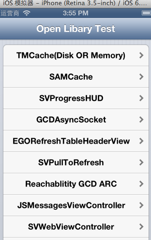
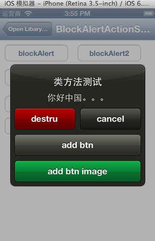

OpenLibTest
===========

收集整理的一些常用iOS开发类库，并写了一些测试例子 

### 列表包括
- AFNetworking
- BlockAlertActionSheet
- TTTAttributeLabel
- SVHTTPRequest
- SVWebViewController
- JSMessagesViewController
- Reachabitity GCD
- SVPullToRefresh
- EGORefreshTableHeaderView
- GCDAsyncSocket
- SVProgressHUD
- SAMCache
- TMCache
- ...

### 运行首页截图

### 示例详情页面

### 学习使用

+ 直接使用 `git clone https://github.com/cocoajin/OpenLibTest.git` 本项目；
+ 或是直接点击右下角的 `Download zip`；

### 不定期更新
本项目会后续增加内容，不定期更新！

### 联系我
Email : `dev.keke@gmail.com`
